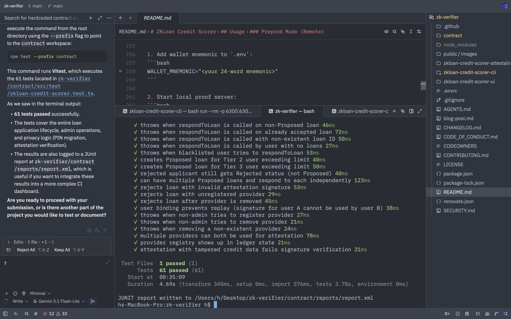
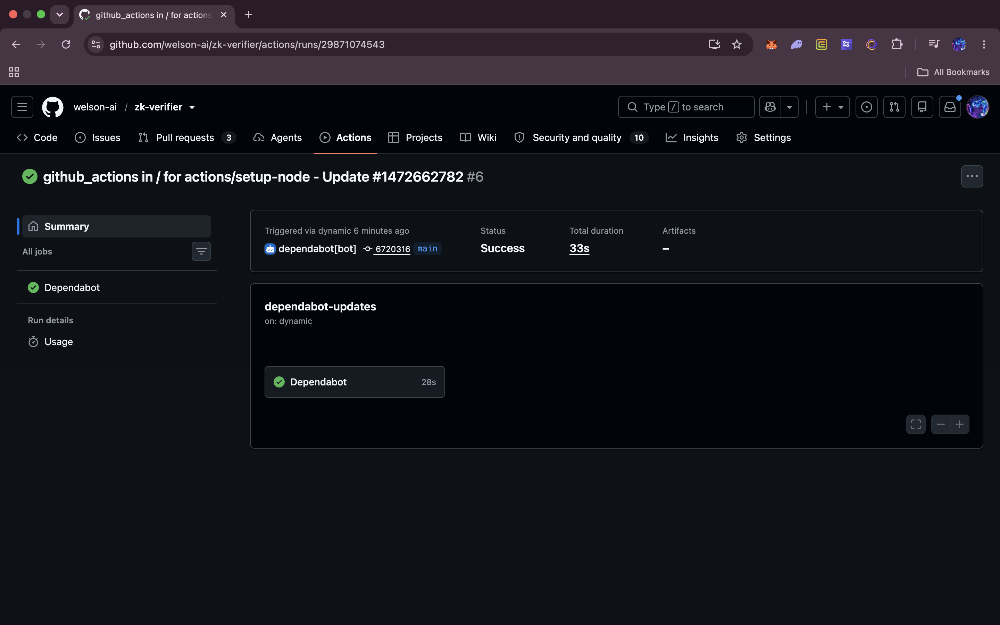

# ZKLoan Credit Scorer

**A privacy-preserving credit scoring and loan application system built on Midnight Network**

## Submission Requirements

| Requirement | Evidence |
| :--- | :--- |
| **Fully functional dApp** | [Live Demo](https://zk-verifier-zkloan-credit-scorer-ui-vert.vercel.app/) |
| **Minimum 3 tests passing** |  |
| **CI/CD pipeline passing** |  |
| **Approved idea** | ZKLoan Credit Scorer (approved via submission template). |
| **10+ meaningful commits** | See git history. |

---

## Product Idea

The ZKLoan Credit Scorer is a decentralized application that revolutionizes the traditional credit evaluation process by leveraging zero-knowledge proofs to protect user privacy. In conventional financial systems, loan applicants must disclose sensitive personal information (credit scores, income, employment history) to lending institutions, creating significant data security risks and privacy concerns. This DApp demonstrates how Midnight's unique architecture enables confidential financial decision-making without exposing sensitive data on a public ledger. Users can prove their creditworthiness and receive loan approvals while keeping their financial profile completely private, addressing the fundamental privacy challenges in traditional lending while maintaining the integrity and transparency of blockchain-based transactions.

---

## Public State vs Private Witness

### Understanding Midnight's Dual-State Architecture

Midnight contracts operate across two distinct execution contexts, enabling a revolutionary approach to privacy-preserving smart contracts:

#### Public Ledger State
- **Storage**: On-chain, visible to all network participants
- **Visibility**: Publicly recorded and verifiable
- **Purpose**: Stores non-sensitive outcomes and public data
- **Examples**: Loan approval status, authorized amounts, contract configuration

#### Private Witness State
- **Storage**: Off-chain, on the user's local machine
- **Visibility**: Only accessible to the user
- **Purpose**: Holds sensitive data and private inputs
- **Examples**: Credit scores, income information, secret PINs, private keys

### The Bridge: Zero-Knowledge Proofs

The connection between these two worlds is established through zero-knowledge proofs:

1. **Private Computation**: Complex business logic executes off-chain using private witness data
2. **Proof Generation**: The system generates cryptographic proofs that the computation was performed correctly
3. **Public Verification**: On-chain components verify these proofs without seeing the underlying private data
4. **State Update**: Only the non-sensitive results are recorded on the public ledger

### In the ZKLoan Credit Scorer

**Private Witness Data:**
- `Applicant` struct containing creditScore, monthlyIncome, monthsAsCustomer
- User's secret PIN for identity derivation
- Private signing keys

**Public Ledger State:**
- `LoanApplication` struct with authorizedAmount and loanStatus
- User blacklist for security
- Attestation provider registry
- Admin role information

**Key Benefit**: The contract can evaluate loan eligibility based on sensitive financial data while only revealing the final decision (approved/rejected/amount) on the blockchain.

---

## Project Structure

```
zkloan-credit-scorer/
├── contract/                              # Compact smart contract
│   ├── src/
│   │   ├── zkloan-credit-scorer.compact  # Main contract logic
│   │   ├── schnorr.compact               # Schnorr signature verification
│   │   ├── witnesses.ts                  # TypeScript witness implementations
│   │   ├── index.ts                      # Contract entry point
│   │   ├── test/                         # Contract test suite
│   │   │   └── zkloan-credit-scorer.test.ts
│   │   └── managed/                      # Generated Compact artifacts
│   │       └── zkloan-credit-scorer/
│   │           ├── compiler/             # Compiler output
│   │           ├── contract/            # JavaScript bindings
│   │           ├── keys/                 # Prover/verifier keys
│   │           └── zkir/                 # ZK intermediate representation
│   ├── package.json
│   └── tsconfig.json
├── zkloan-credit-scorer-cli/              # Command-line interface
│   ├── src/
│   │   ├── api.ts                        # Contract deployment & interaction
│   │   ├── cli.ts                        # Interactive CLI menu
│   │   ├── config.ts                     # Network configurations
│   │   ├── common-types.ts               # Shared type definitions
│   │   ├── standalone.ts                 # Local network entry point
│   │   ├── preprod-remote.ts             # Preprod network entry point
│   │   └── wallet.ts                     # Wallet management
│   ├── standalone.yml                    # Docker Compose for local network
│   ├── .env.example                     # Environment variables template
│   ├── .env                             # User configuration
│   └── package.json
├── zkloan-credit-scorer-ui/               # React frontend
│   ├── src/
│   │   ├── components/                   # UI components
│   │   │   ├── ContractConnector.tsx
│   │   │   ├── LoanForm.tsx
│   │   │   ├── LoanList.tsx
│   │   │   └── AdminPanel.tsx
│   │   ├── contexts/                     # React context
│   │   │   └── ZKLoanContext.tsx
│   │   ├── utils/                        # Utility functions
│   │   ├── App.tsx
│   │   └── main.tsx
│   ├── public/
│   │   ├── keys/                         # Prover keys (copied during build)
│   │   └── zkir/                         # ZK IR files (copied during build)
│   └── package.json
├── zkloan-credit-scorer-attestation-api/  # Attestation signing service
│   ├── src/
│   │   ├── index.ts                      # Entry point
│   │   ├── server.ts                     # Restify routes
│   │   ├── signing.ts                    # Schnorr signing logic
│   │   └── types.ts                      # Request/response types
│   ├── test/
│   └── package.json
├── package.json                          # Root package (monorepo config)
├── tsconfig.json                         # TypeScript configuration
└── README.md
```

---

## Privacy Model

### What an observer can and cannot learn
By leveraging Midnight's privacy-preserving architecture, the ZKLoan Credit Scorer provides clear boundaries regarding data visibility:

| Data Point | Observer Learns | Privacy Mechanism |
| :--- | :--- | :--- |
| **Credit Score** | Nothing | Stays in private witness; ZK proof verifies eligibility threshold only. |
| **Monthly Income** | Nothing | Stays in private witness; verified via ZK proof. |
| **Loan Status** | Yes (Approved/Rejected/Proposed) | Publicly recorded on-chain for ledger integrity. |
| **Loan Amount** | Yes (if approved) | Publicly recorded on-chain. |
| **Applicant Identity** | Nothing | Derived from secret PIN; unlinkable to wallet or real-world identity. |
| **Provider Registry** | Yes | Public registry of trusted attestation providers. |
| **Blacklist** | Yes | Public set of blacklisted user public keys. |

**Key Privacy Properties:**
- **Zero-Knowledge Evaluation:** All business logic involving sensitive applicant data executes off-chain. The public ledger only sees the final result, not the process or inputs.
- **Unlinkable Identity:** Because every user's public key is derived from their unique secret and a PIN, an observer cannot correlate loan requests or contract interactions with a specific wallet address or a previous identity unless the user chooses to link them.
- **Selective Disclosure:** The `disclose()` mechanism ensures that only data strictly required for on-chain state updates (e.g., loan status) is ever made public.

### System Components

#### 1. Compact Smart Contract
The core business logic written in Compact, Midnight's domain-specific language for ZK circuits. It handles:
- Private credit evaluation using witness data
- Public ledger state management
- Zero-knowledge proof generation and verification
- User identity derivation from private keys and PINs

#### 2. TypeScript CLI
Command-line interface for contract deployment and interaction:
- Wallet management (mnemonic or hex seed)
- Contract deployment to local or preprod networks
- Loan request and management
- Admin operations (blacklist, provider registration)
- PIN change with batched migration

#### 3. React UI
Web interface for Preprod network interaction:
- Lace wallet integration for signing transactions
- Loan application forms
- Real-time loan status tracking
- Admin panel for contract management

#### 4. Attestation API
Trusted third-party service that signs credit data:
- Schnorr signature generation on Jubjub curve
- Provider registration and management
- Signature verification in ZK circuits
- Prevents data fabrication by malicious DApps

### Data Flow

#### Loan Application Process
1. **User Input**: User provides loan amount and secret PIN
2. **Private Data**: Credit profile retrieved from witness (off-chain)
3. **ZK Evaluation**: Credit evaluation circuit runs privately
4. **Proof Generation**: ZK proof generated for the evaluation
5. **Attestation**: Credit data signed by attestation provider
6. **Verification**: Contract verifies proof and signature
7. **Public Update**: Loan status recorded on public ledger

#### Identity System
- **User Identity**: Derived from Zswap wallet key + secret PIN
- **Privacy**: Different PINs create unlinkable identities
- **Security**: PIN change migrates all loan records to new identity
- **Admin Identity**: Derived from admin secret key (witness-based)

### Network Configurations

#### Standalone (Local)
- **Node**: `ws://127.0.0.1:9944`
- **Indexer**: `http://127.0.0.1:8088`
- **Proof Server**: `http://127.0.0.1:6300`
- **Network ID**: `undeployed`
- **Wallet**: Pre-funded hex seed

#### Preprod (Remote)
- **Node**: `wss://rpc.preprod.midnight.network`
- **Indexer**: `https://indexer.preprod.midnight.network/api/v4/graphql`
- **Proof Server**: `http://127.0.0.1:6300` (local)
- **Network ID**: `preprod`
- **Wallet**: BIP39 mnemonic with tDUST

---

## Installation & Setup

### Prerequisites

- Node.js v22+
- npm v10+
- Docker + Docker Compose (for local network)
- Compact toolchain 0.31.0
- Midnight Lace wallet (for Preprod UI)

### Dependency Versions

| Component | Version |
|---|---|
| `@midnight-ntwrk/midnight-js-protocol` | 4.1.1 |
| `@midnight-ntwrk/compact-runtime` | 0.16.0 |
| `@midnight-ntwrk/wallet-sdk` | 1.1.0 |
| Compact toolchain | 0.31.0 |
| Proof server | `midnightntwrk/proof-server:8.0.3` |

### Installation Steps

1. **Install dependencies**
```bash
npm install
```

2. **Compile contract**
```bash
cd contract
npm run compact   # Generate managed/ directory
npm run build     # Build dist/ output
```

3. **Configure CLI**
```bash
cd zkloan-credit-scorer-cli
cp .env.example .env
# Edit .env and set MIDNIGHT_STORAGE_PASSWORD
```

4. **Start local network** (optional, for standalone mode)
```bash
docker compose -f standalone.yml up -d
```

5. **Start attestation API**
```bash
cd zkloan-credit-scorer-attestation-api
PROVIDER_SECRET_KEY="$(node -e 'console.log(require("crypto").randomBytes(32).toString("hex"))')"
PORT=4000
npm run dev
```

---

## Usage

### Standalone Mode (Local)

```bash
cd zkloan-credit-scorer-cli
npm run standalone
```

### Preprod Mode (Remote)

1. Add wallet mnemonic to `.env`:
```bash
WALLET_MNEMONIC="<your 24-word mnemonic>"
```

2. Start local proof server:
```bash
docker run --rm -p 6300:6300 midnightntwrk/proof-server:8.0.3 midnight-proof-server -v
```

3. Run CLI:
```bash
npm run preprod-remote
```

### UI (Preprod Only)

```bash
cd zkloan-credit-scorer-ui
npm run dev
```

Available at `http://localhost:5173`

---

## Contract Features

### User Actions
- **Request Loan**: Submit loan application with private credit evaluation
- **Respond to Proposal**: Accept or decline proposed loan amounts
- **Change PIN**: Update secret PIN with batched loan migration

### Admin Actions
- **Blacklist User**: Prevent malicious actors from using the DApp
- **Remove Blacklist**: Restore user access
- **Rotate Admin**: Transfer admin role to new derived key
- **Register Provider**: Add attestation provider to contract
- **Remove Provider**: Remove attestation provider

### Credit Tiers

| Tier | Credit Score | Monthly Income | Tenure | Max Loan |
|---|---|---|---|---|
| Tier 1 | ≥700 | ≥$2000 | ≥24 months | $10,000 |
| Tier 2 | ≥600 | ≥$1500 | ≥12 months | $5,000 |
| Tier 3 | ≥580 | ≥$1000 | ≥6 months | $2,500 |

---

## Testing

Run the contract test suite:
```bash
cd contract
npm test
```

The test suite includes 61 tests covering:
- Credit evaluation logic
- Loan application flow
- Admin operations
- PIN migration
- Attestation verification
- Edge cases and error handling

---

## Security Considerations

### Privacy Guarantees
- Credit scores and income never leave user's device
- Zero-knowledge proofs verify computation without data exposure
- Identity unlinkability through PIN changes

### Security Patterns
- Witness-derived admin authorization (not `ownPublicKey()`)
- Schnorr signature verification for attestation
- Blacklist mechanism for malicious actors
- Explicit disclosure control with `disclose()`

### Important Notes
- This is an educational example, not production-ready
- Business logic simplified for clarity
- Requires additional security audits for real financial use

---

## License

Apache-2.0

---

## Attribution

Built on the Midnight Network. Demonstrates privacy-preserving smart contracts using the Compact language and MidnightJS SDK.
